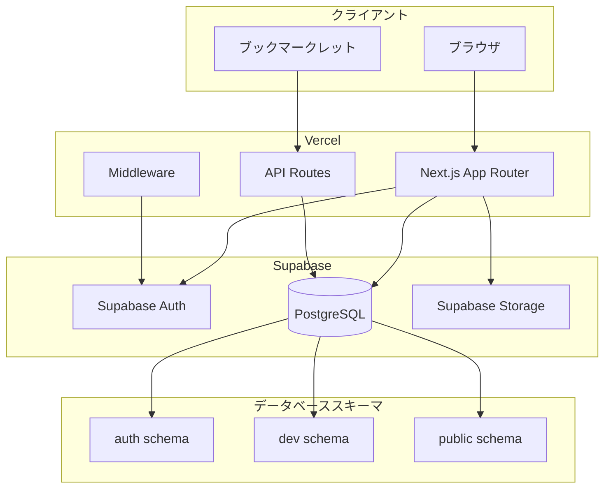

# 設計書

## 概要

GCM Arenaは、Next.js App RouterとSupabaseを使用した音楽ゲーム大会プラットフォームです。本設計書では、フロントエンド、バックエンド、データベース、認証、セキュリティの各層における技術的な実装方針を定義します。

主要な設計原則：
- **破綻しない設計**：中長期運用を前提とした堅牢な構造
- **権限の明確化**：RLSによるデータベースレベルでのアクセス制御
- **再計算可能性**：ランキングなどの派生データは常に再計算可能
- **停止可能性**：外部依存（ブックマークレット）は即座に停止可能

## アーキテクチャ

### システム構成図



### レイヤー構成

1. **プレゼンテーション層**（Next.js）
   - Server Components：初期レンダリング、SEO対応
   - Client Components：インタラクティブUI
   - Route Handlers：API エンドポイント

2. **認証・認可層**（Supabase Auth + Middleware）
   - セッション管理（HTTPOnly Cookie）
   - RLSポリシーによる行レベルアクセス制御

3. **データ層**（Supabase PostgreSQL）
   - スキーマベースの環境分離（dev / public）
   - トランザクション保証
   - 自動バックアップ

4. **ストレージ層**（Supabase Storage）
   - 画像提出の一時保存
   - 大会終了時の自動削除

## コンポーネントとインターフェース

### フロントエンド構成

```
src/
├── app/
│   ├── (auth)/
│   │   ├── login/
│   │   │   └── page.tsx
│   │   └── register/
│   │       └── page.tsx
│   ├── (main)/
│   │   ├── tournaments/
│   │   │   ├── page.tsx              # 大会一覧
│   │   │   ├── [id]/
│   │   │   │   ├── page.tsx          # 大会詳細
│   │   │   │   └── ranking/
│   │   │   │       └── page.tsx      # ランキング
│   │   │   └── create/
│   │   │       └── page.tsx          # 大会作成
│   │   ├── my/
│   │   │   ├── page.tsx              # マイページ
│   │   │   ├── profile/
│   │   │   │   └── page.tsx          # プロフィール編集
│   │   │   └── tournaments/
│   │   │       └── [id]/
│   │   │           └── manage/
│   │   │               └── page.tsx  # 開催者管理画面
│   │   └── submit/
│   │       └── [tournamentId]/
│   │           └── page.tsx          # スコア提出
│   ├── api/
│   │   ├── bookmarklet/
│   │   │   └── submit/
│   │   │       └── route.ts          # ブックマークレット用API
│   │   ├── tournaments/
│   │   │   └── [id]/
│   │   │       ├── join/
│   │   │       │   └── route.ts
│   │   │       ├── leave/
│   │   │       │   └── route.ts
│   │   │       └── recalculate/
│   │   │           └── route.ts
│   │   └── scores/
│   │       └── route.ts
│   ├── terms/
│   │   └── page.tsx                  # 利用規約
│   ├── layout.tsx
│   └── page.tsx                      # トップページ
├── components/
│   ├── auth/
│   │   ├── LoginForm.tsx
│   │   └── RegisterForm.tsx
│   ├── tournaments/
│   │   ├── TournamentCard.tsx
│   │   ├── TournamentList.tsx
│   │   ├── TournamentForm.tsx
│   │   └── RankingTable.tsx
│   ├── scores/
│   │   ├── ScoreSubmitForm.tsx
│   │   └── ImageUpload.tsx
│   └── ui/
│       ├── Button.tsx
│       ├── Input.tsx
│       └── Card.tsx
├── lib/
│   ├── supabase/
│   │   ├── client.ts                 # クライアント用Supabaseクライアント
│   │   ├── server.ts                 # サーバー用Supabaseクライアント
│   │   └── middleware.ts             # Middleware用Supabaseクライアント
│   ├── types/
│   │   └── database.ts               # データベース型定義
│   └── utils/
│       ├── ranking.ts                # ランキング計算ロジック
│       └── validation.ts             # バリデーション
└── middleware.ts                     # Next.js Middleware
```

### 主要コンポーネント

#### 1. 認証コンポーネント

**LoginForm / RegisterForm**
- メールアドレス + パスワード認証
- Supabase Auth統合
- エラーハンドリング

#### 2. 大会コンポーネント

**TournamentList**
- 大会一覧表示
- フィルタリング（ゲーム種別、ステータス）
- ページネーション

**TournamentForm**
- 大会作成・編集フォーム
- 楽曲選択UI
- 期間設定（DatePicker）
- ルール入力（構造化 + 自由記述）

**RankingTable**
- ランキング表示
- ソート機能
- 参加者情報表示

#### 3. スコア提出コンポーネント

**ScoreSubmitForm**
- 手動スコア入力
- バリデーション

**ImageUpload**
- ドラッグ&ドロップ対応
- プレビュー表示
- Supabase Storageへのアップロード

### API設計

#### 認証API

```typescript
// Supabase Authを使用するため、カスタムAPIは不要
// クライアント側でsupabase.auth.signIn()等を使用
```

#### 大会API

```typescript
// GET /api/tournaments
// レスポンス: Tournament[]

// POST /api/tournaments
// リクエスト: CreateTournamentRequest
// レスポンス: Tournament

// GET /api/tournaments/[id]
// レスポンス: TournamentDetail

// POST /api/tournaments/[id]/join
// レスポンス: { success: boolean }

// POST /api/tournaments/[id]/leave
// レスポンス: { success: boolean }

// POST /api/tournaments/[id]/recalculate
// レスポンス: { success: boolean }
```

#### スコア提出API

```typescript
// POST /api/bookmarklet/submit
// リクエスト: BookmarkletSubmission
// レスポンス: { success: boolean, scoreId: string }

// POST /api/scores
// リクエスト: ManualScoreSubmission
// レスポンス: { success: boolean, scoreId: string }
```

## データモデル

### スキーマ構成

```sql
-- 環境変数 SUPABASE_SCHEMA で切り替え
-- dev: 開発環境
-- public: 本番環境
```

### テーブル定義

#### profiles テーブル

```sql
create table {schema}.profiles (
  id uuid primary key references auth.users (id) on delete cascade,
  display_name text,
  created_at timestamptz not null default now(),
  updated_at timestamptz not null default now(),
  is_active boolean not null default true,
  deleted_at timestamptz
);

-- RLS ポリシー
alter table {schema}.profiles enable row level security;

-- 全ユーザーが閲覧可能
create policy "profiles_select_policy"
  on {schema}.profiles for select
  using (true);

-- 自分のプロフィールのみ更新可能
create policy "profiles_update_policy"
  on {schema}.profiles for update
  using (auth.uid() = id);
```

#### tournaments テーブル

```sql
create type {schema}.game_type as enum ('ongeki', 'chunithm', 'maimai');
create type {schema}.tournament_status as enum ('upcoming', 'active', 'ended');
create type {schema}.submission_method as enum ('bookmarklet', 'image', 'both');

create table {schema}.tournaments (
  id uuid primary key default gen_random_uuid(),
  organizer_id uuid not null references {schema}.profiles (id) on delete cascade,
  title text not null,
  description text,
  game_type {schema}.game_type not null,
  submission_method {schema}.submission_method not null default 'both',
  start_at timestamptz not null,
  end_at timestamptz not null,
  is_public boolean not null default true,
  rules jsonb not null default '{}',
  created_at timestamptz not null default now(),
  updated_at timestamptz not null default now(),
  
  constraint valid_period check (start_at < end_at)
);

-- RLS ポリシー
alter table {schema}.tournaments enable row level security;

-- 公開大会は全員が閲覧可能
create policy "tournaments_select_public"
  on {schema}.tournaments for select
  using (is_public = true);

-- 非公開大会は参加者のみ閲覧可能
create policy "tournaments_select_private"
  on {schema}.tournaments for select
  using (
    is_public = false and (
      organizer_id = auth.uid() or
      exists (
        select 1 from {schema}.participants
        where tournament_id = id and user_id = auth.uid()
      )
    )
  );

-- 認証済みユーザーは大会を作成可能
create policy "tournaments_insert_policy"
  on {schema}.tournaments for insert
  with check (auth.uid() = organizer_id);

-- 開催者のみ更新可能（開始前のみ）
create policy "tournaments_update_policy"
  on {schema}.tournaments for update
  using (
    auth.uid() = organizer_id and
    start_at > now()
  );
```

#### tournament_songs テーブル

```sql
create table {schema}.tournament_songs (
  id uuid primary key default gen_random_uuid(),
  tournament_id uuid not null references {schema}.tournaments (id) on delete cascade,
  song_id uuid not null references {schema}.songs (id) on delete restrict,
  created_at timestamptz not null default now(),
  
  unique (tournament_id, song_id)
);

-- RLS ポリシー
alter table {schema}.tournament_songs enable row level security;

-- 大会が閲覧可能なら楽曲も閲覧可能
create policy "tournament_songs_select_policy"
  on {schema}.tournament_songs for select
  using (
    exists (
      select 1 from {schema}.tournaments
      where id = tournament_id
    )
  );

-- 開催者のみ追加可能
create policy "tournament_songs_insert_policy"
  on {schema}.tournament_songs for insert
  with check (
    exists (
      select 1 from {schema}.tournaments
      where id = tournament_id and organizer_id = auth.uid()
    )
  );
```

#### participants テーブル

```sql
create table {schema}.participants (
  id uuid primary key default gen_random_uuid(),
  tournament_id uuid not null references {schema}.tournaments (id) on delete cascade,
  user_id uuid not null references {schema}.profiles (id) on delete cascade,
  joined_at timestamptz not null default now(),
  
  unique (tournament_id, user_id)
);

-- RLS ポリシー
alter table {schema}.participants enable row level security;

-- 大会が閲覧可能なら参加者も閲覧可能
create policy "participants_select_policy"
  on {schema}.participants for select
  using (
    exists (
      select 1 from {schema}.tournaments
      where id = tournament_id
    )
  );

-- 認証済みユーザーは参加可能
create policy "participants_insert_policy"
  on {schema}.participants for insert
  with check (auth.uid() = user_id);

-- 自分の参加記録のみ削除可能
create policy "participants_delete_policy"
  on {schema}.participants for delete
  using (auth.uid() = user_id);
```

#### scores テーブル

```sql
create type {schema}.score_status as enum ('pending', 'approved', 'rejected');

create table {schema}.scores (
  id uuid primary key default gen_random_uuid(),
  tournament_id uuid not null references {schema}.tournaments (id) on delete cascade,
  user_id uuid not null references {schema}.profiles (id) on delete cascade,
  song_id uuid not null references {schema}.songs (id) on delete restrict,
  score integer not null,
  status {schema}.score_status not null default 'approved',
  image_url text,
  submitted_via text not null, -- 'bookmarklet' or 'image'
  submitted_at timestamptz not null default now(),
  approved_at timestamptz,
  approved_by uuid references {schema}.profiles (id),
  
  constraint valid_score check (score >= 0)
);

-- RLS ポリシー
alter table {schema}.scores enable row level security;

-- 参加者は大会のスコアを閲覧可能
create policy "scores_select_policy"
  on {schema}.scores for select
  using (
    exists (
      select 1 from {schema}.participants
      where tournament_id = scores.tournament_id
    )
  );

-- 参加者は自分のスコアを提出可能
create policy "scores_insert_policy"
  on {schema}.scores for insert
  with check (
    auth.uid() = user_id and
    exists (
      select 1 from {schema}.participants
      where tournament_id = scores.tournament_id and user_id = auth.uid()
    )
  );

-- 開催者は画像提出のスコアを承認可能
create policy "scores_update_policy"
  on {schema}.scores for update
  using (
    exists (
      select 1 from {schema}.tournaments
      where id = tournament_id and organizer_id = auth.uid()
    )
  );
```

#### songs テーブル

```sql
create type {schema}.difficulty as enum ('basic', 'advanced', 'expert', 'master', 'ultima', 'world_end');

create table {schema}.songs (
  id uuid primary key default gen_random_uuid(),
  game_type {schema}.game_type not null,
  title text not null,
  artist text,
  difficulty {schema}.difficulty not null,
  level numeric(3,1) not null,
  created_at timestamptz not null default now(),
  updated_at timestamptz not null default now(),
  
  unique (game_type, title, difficulty)
);

-- RLS ポリシー
alter table {schema}.songs enable row level security;

-- 全ユーザーが閲覧可能
create policy "songs_select_policy"
  on {schema}.songs for select
  using (true);
```

#### notifications テーブル

```sql
create table {schema}.notifications (
  id uuid primary key default gen_random_uuid(),
  user_id uuid not null references {schema}.profiles (id) on delete cascade,
  message text not null,
  is_read boolean not null default false,
  created_at timestamptz not null default now()
);

-- RLS ポリシー
alter table {schema}.notifications enable row level security;

-- 自分の通知のみ閲覧可能
create policy "notifications_select_policy"
  on {schema}.notifications for select
  using (auth.uid() = user_id);

-- 自分の通知のみ更新可能
create policy "notifications_update_policy"
  on {schema}.notifications for update
  using (auth.uid() = user_id);
```

### データベース関数

#### ランキング計算関数

```sql
create or replace function {schema}.calculate_ranking(p_tournament_id uuid)
returns table (
  user_id uuid,
  display_name text,
  total_score bigint,
  rank bigint
) as $$
begin
  return query
  select
    p.user_id,
    pr.display_name,
    sum(s.score)::bigint as total_score,
    rank() over (order by sum(s.score) desc) as rank
  from {schema}.participants p
  join {schema}.profiles pr on pr.id = p.user_id
  left join {schema}.scores s on s.user_id = p.user_id
    and s.tournament_id = p.tournament_id
    and s.status = 'approved'
  where p.tournament_id = p_tournament_id
  group by p.user_id, pr.display_name
  order by total_score desc;
end;
$$ language plpgsql security definer;
```

#### 大会ステータス更新トリガー

```sql
-- 大会ステータスを自動更新するビュー
create or replace view {schema}.tournaments_with_status as
select
  t.*,
  case
    when now() < t.start_at then 'upcoming'::tournament_status
    when now() between t.start_at and t.end_at then 'active'::tournament_status
    else 'ended'::tournament_status
  end as status
from {schema}.tournaments t;
```

## 正確性プロパティ

プロパティとは、システムのすべての有効な実行において真であるべき特性や振る舞いのことです。これは、人間が読める仕様と機械で検証可能な正確性保証の橋渡しとなります。


### プロパティリフレクション

プレワーク分析から、以下の冗長性と統合の機会を特定しました：

1. **プロフィール更新と RLS ポリシー**: 1.3（プロフィール更新）と 1.7（RLS による更新制限）は、同じ更新操作の異なる側面をテストしています。これらは1つの包括的なプロパティに統合できます。

2. **大会作成の複数の側面**: 2.1（フィールド保存）と 2.3（開催者割り当て）は、大会作成の異なる側面です。これらは1つのプロパティに統合できます。

3. **スコア提出の関連付け**: 4.4（ユーザーと大会の関連付け）と 5.5（画像提出の関連付け）は、同じ概念を異なる提出方法に適用しています。これらは1つのプロパティに統合できます。

4. **ランキング表示の要素**: 6.2（降順ソート）と 6.6（表示フィールド）は、ランキング表示の異なる側面です。これらは1つのプロパティに統合できます。

5. **大会詳細の表示**: 7.2（詳細フィールド）と 7.6（開催者名）は、大会詳細表示の異なる側面です。これらは1つのプロパティに統合できます。

6. **開催者の更新権限**: 8.5（開始前の更新）と 8.6（開始後の更新防止）は、同じ更新操作の時間的条件です。これらは1つのプロパティに統合できます。

### 正確性プロパティ

#### プロパティ 1: プロフィール更新の所有権

*任意の*ユーザーについて、そのユーザーは自分自身のプロフィールを更新でき、他のユーザーのプロフィールを更新することはできない

**検証: 要件 1.3, 1.7**

#### プロパティ 2: プロフィールの閲覧可能性

*任意の*ユーザーについて、そのユーザーは任意の他のユーザーのプロフィールを閲覧できる

**検証: 要件 1.6**

#### プロパティ 3: カスケード削除

*任意の*ユーザーについて、auth.usersからそのユーザーが削除されると、対応するprofilesレコードも削除される

**検証: 要件 1.5**

#### プロパティ 4: 大会作成の完全性

*任意の*大会作成リクエストについて、作成されたレコードには、指定されたすべてのフィールド（ゲーム、楽曲、期間、提出方式、ルール）が含まれ、作成ユーザーがorganizer_idとして設定される

**検証: 要件 2.1, 2.3**

#### プロパティ 5: アクティブ大会の制限

*任意の*ユーザーについて、そのユーザーが既にアクティブな大会を開催している場合、2つ目のアクティブな大会を作成することはできない

**検証: 要件 2.2**

#### プロパティ 6: 大会の楽曲要件

*任意の*大会について、その大会には少なくとも1つの対象楽曲が関連付けられている

**検証: 要件 2.4**

#### プロパティ 7: 大会更新の時間的制約

*任意の*大会について、その大会の詳細は開始時刻前にのみ更新可能であり、開始後は更新できない

**検証: 要件 2.5, 8.5, 8.6**

#### プロパティ 8: 参加記録の作成と削除

*任意の*ログイン済みユーザーと大会について、そのユーザーは参加記録を作成でき、後で削除できる

**検証: 要件 3.1, 3.2**

#### プロパティ 9: 無制限の参加

*任意の*ユーザーについて、そのユーザーは任意の数の大会に参加できる

**検証: 要件 3.3**

#### プロパティ 10: 重複参加の防止

*任意の*ユーザーと大会について、そのユーザーが既に参加している大会に再度参加しようとすると、リクエストは拒否される

**検証: 要件 3.6**

#### プロパティ 11: スコア提出の検証と保存

*任意の*有効なスコアデータについて、APIがそれを受信すると、検証が行われ、有効な場合はデータベースに保存される

**検証: 要件 4.3**

#### プロパティ 12: スコア提出の関連付け

*任意の*スコア提出（ブックマークレットまたは画像）について、そのレコードには提出ユーザーのuser_idと対象大会のtournament_idが含まれる

**検証: 要件 4.4, 5.5**

#### プロパティ 13: スコア提出による記録更新

*任意の*スコア提出について、提出が成功すると、その楽曲に対する参加者のスコアレコードが作成または更新される

**検証: 要件 4.6**

#### プロパティ 14: 画像の保存と保留状態

*任意の*画像アップロードについて、画像はSupabase Storageに保存され、status='pending'のスコアレコードが作成される

**検証: 要件 5.1, 5.2**

#### プロパティ 15: 開催者によるスコア承認

*任意の*画像提出について、大会の開催者はそのスコアを承認し、手動で値を入力できる

**検証: 要件 5.3, 8.2**

#### プロパティ 16: 大会終了時の画像削除

*任意の*大会について、その大会が終了すると、関連するすべての画像がSupabase Storageから削除される

**検証: 要件 5.4**

#### プロパティ 17: ランキングの自動再計算

*任意の*スコア提出について、提出が承認されると、大会のランキングが再計算される

**検証: 要件 6.1**

#### プロパティ 18: ランキングの表示形式

*任意の*大会のランキングについて、参加者はスコアの降順でソートされ、各エントリには参加者名、スコア、順位が含まれる

**検証: 要件 6.2, 6.6**

#### プロパティ 19: 公開大会のランキング閲覧

*任意の*公開大会について、そのランキングは非参加者を含むすべてのユーザーが閲覧できる

**検証: 要件 6.4**

#### プロパティ 20: 非公開大会のランキング制限

*任意の*非公開大会について、そのランキングは参加者のみが閲覧できる

**検証: 要件 6.5**

#### プロパティ 21: 公開大会の一覧表示

*任意の*大会一覧リクエストについて、返される結果にはすべての公開大会が含まれ、非公開大会は含まれない

**検証: 要件 7.1, 7.5**

#### プロパティ 22: 大会詳細の完全性

*任意の*大会詳細リクエストについて、返されるデータにはゲーム、楽曲、期間、ルール、参加者、開催者名が含まれる

**検証: 要件 7.2, 7.6**

#### プロパティ 23: ゲームタイプによるフィルタリング

*任意の*ゲームタイプフィルタについて、返される大会はすべて指定されたゲームタイプに一致する

**検証: 要件 7.3**

#### プロパティ 24: 大会ステータスの計算

*任意の*大会について、そのステータス（開催前、開催中、終了）は現在時刻と大会期間に基づいて正しく計算される

**検証: 要件 7.4**

#### プロパティ 25: 開催者による提出の閲覧

*任意の*開催者について、その開催者は自分の大会のすべてのスコア提出を閲覧できる

**検証: 要件 8.1**

#### プロパティ 26: 参加者統計の計算

*任意の*大会について、開催者が閲覧する統計（参加者数、提出数など）は正しく計算される

**検証: 要件 8.4**

#### プロパティ 27: イベント通知の作成

*任意の*大会関連イベント（開始、終了、新規参加）について、そのイベントが発生すると、関連ユーザーに通知レコードが作成される

**検証: 要件 9.1**

#### プロパティ 28: 未読通知の識別

*任意の*ユーザーの通知リストについて、未読通知（is_read=false）は既読通知と区別される

**検証: 要件 9.2**

#### プロパティ 29: 通知の既読マーク

*任意の*通知について、ユーザーがそれを既読としてマークすると、is_readフラグがtrueに更新される

**検証: 要件 9.3**

#### プロパティ 30: 通知履歴の閲覧

*任意の*ユーザーについて、そのユーザーは自分の通知履歴を閲覧でき、他のユーザーの通知は閲覧できない

**検証: 要件 9.6**

#### プロパティ 31: 楽曲データの参照整合性

*任意の*楽曲データ更新について、既存の大会が参照している楽曲は削除されず、参照が保持される

**検証: 要件 10.3**

#### プロパティ 32: JSONインポートのラウンドトリップ

*任意の*有効な楽曲データJSONについて、インポート後にエクスポートすると、元のデータと等価なJSONが生成される

**検証: 要件 10.6**

#### プロパティ 33: 規約更新の通知

*任意の*利用規約更新について、更新が行われると、すべての既存ユーザーに通知が作成される

**検証: 要件 12.6**

#### プロパティ 34: 他人のデータ変更の防止

*任意の*ユーザーについて、そのユーザーは他のユーザーが所有するデータ（プロフィール、大会、スコアなど）を変更できない

**検証: 要件 13.2**

#### プロパティ 35: 公開データの非認証閲覧

*任意の*非認証ユーザーについて、そのユーザーは公開大会データを閲覧できる

**検証: 要件 13.3**

#### プロパティ 36: 書き込み操作の認証要件

*任意の*書き込み操作（作成、更新、削除）について、非認証ユーザーによるリクエストは拒否される

**検証: 要件 13.4**

#### プロパティ 37: RLSによる権限チェック

*任意の*データベース操作について、RLSポリシーにより権限チェックが実施され、直接APIアクセスでもバイパスされない

**検証: 要件 13.5, 13.6**

## エラーハンドリング

### エラーの分類

1. **バリデーションエラー**
   - 不正な入力データ
   - 必須フィールドの欠落
   - 形式エラー（メールアドレス、日付など）

2. **認証・認可エラー**
   - 未認証アクセス
   - 権限不足
   - セッション期限切れ

3. **ビジネスロジックエラー**
   - 重複参加
   - アクティブ大会の制限超過
   - 開始後の大会編集

4. **外部サービスエラー**
   - Supabase接続エラー
   - Storage アップロードエラー
   - ブックマークレットDOM解析エラー

5. **システムエラー**
   - データベースエラー
   - 予期しない例外

### エラーレスポンス形式

```typescript
interface ErrorResponse {
  error: {
    code: string;
    message: string;
    details?: Record<string, any>;
  };
}
```

### エラーコード一覧

```typescript
enum ErrorCode {
  // 認証エラー (AUTH_*)
  AUTH_REQUIRED = 'AUTH_REQUIRED',
  AUTH_INVALID_CREDENTIALS = 'AUTH_INVALID_CREDENTIALS',
  AUTH_SESSION_EXPIRED = 'AUTH_SESSION_EXPIRED',
  
  // 認可エラー (AUTHZ_*)
  AUTHZ_FORBIDDEN = 'AUTHZ_FORBIDDEN',
  AUTHZ_NOT_ORGANIZER = 'AUTHZ_NOT_ORGANIZER',
  
  // バリデーションエラー (VALIDATION_*)
  VALIDATION_REQUIRED_FIELD = 'VALIDATION_REQUIRED_FIELD',
  VALIDATION_INVALID_FORMAT = 'VALIDATION_INVALID_FORMAT',
  VALIDATION_INVALID_PERIOD = 'VALIDATION_INVALID_PERIOD',
  
  // ビジネスロジックエラー (BUSINESS_*)
  BUSINESS_DUPLICATE_PARTICIPATION = 'BUSINESS_DUPLICATE_PARTICIPATION',
  BUSINESS_ACTIVE_TOURNAMENT_LIMIT = 'BUSINESS_ACTIVE_TOURNAMENT_LIMIT',
  BUSINESS_TOURNAMENT_STARTED = 'BUSINESS_TOURNAMENT_STARTED',
  BUSINESS_NO_SONGS = 'BUSINESS_NO_SONGS',
  
  // 外部サービスエラー (EXTERNAL_*)
  EXTERNAL_SUPABASE_ERROR = 'EXTERNAL_SUPABASE_ERROR',
  EXTERNAL_STORAGE_ERROR = 'EXTERNAL_STORAGE_ERROR',
  EXTERNAL_BOOKMARKLET_PARSE_ERROR = 'EXTERNAL_BOOKMARKLET_PARSE_ERROR',
  
  // システムエラー (SYSTEM_*)
  SYSTEM_INTERNAL_ERROR = 'SYSTEM_INTERNAL_ERROR',
  SYSTEM_DATABASE_ERROR = 'SYSTEM_DATABASE_ERROR',
}
```

### エラーハンドリング戦略

#### クライアント側

```typescript
// エラーハンドリングユーティリティ
export function handleApiError(error: unknown): ErrorResponse {
  if (error instanceof ApiError) {
    return error.toResponse();
  }
  
  // 予期しないエラー
  console.error('Unexpected error:', error);
  return {
    error: {
      code: ErrorCode.SYSTEM_INTERNAL_ERROR,
      message: 'システムエラーが発生しました',
    },
  };
}

// React コンポーネントでの使用例
try {
  await createTournament(data);
} catch (error) {
  const errorResponse = handleApiError(error);
  toast.error(errorResponse.error.message);
}
```

#### サーバー側（API Routes）

```typescript
// API Route でのエラーハンドリング
export async function POST(request: Request) {
  try {
    // ビジネスロジック
    const result = await createTournament(data);
    return NextResponse.json(result);
  } catch (error) {
    if (error instanceof ValidationError) {
      return NextResponse.json(
        { error: { code: error.code, message: error.message } },
        { status: 400 }
      );
    }
    
    if (error instanceof AuthorizationError) {
      return NextResponse.json(
        { error: { code: error.code, message: error.message } },
        { status: 403 }
      );
    }
    
    // 予期しないエラー
    console.error('Unexpected error:', error);
    return NextResponse.json(
      { error: { code: ErrorCode.SYSTEM_INTERNAL_ERROR, message: 'システムエラー' } },
      { status: 500 }
    );
  }
}
```

#### データベース側（RLS）

```sql
-- RLS ポリシーでのエラーは暗黙的に処理される
-- 権限がない場合、行が返されないか、操作が拒否される
-- アプリケーション側で適切なエラーメッセージを表示
```

### ブックマークレット特有のエラーハンドリング

```typescript
// ブックマークレット内
try {
  const scoreData = extractScoreFromDOM();
  await submitToAPI(scoreData);
  alert('スコアを提出しました');
} catch (error) {
  if (error instanceof DOMParseError) {
    alert('ページ構造が変更されています。サービスを一時停止します。');
    // 管理者に通知
    await notifyAdmin(error);
  } else {
    alert('スコア提出に失敗しました');
  }
}
```

## テスト戦略

### テストアプローチ

本プロジェクトでは、**ユニットテスト**と**プロパティベーステスト**の両方を使用します。

- **ユニットテスト**: 特定の例、エッジケース、エラー条件を検証
- **プロパティベーステスト**: すべての入力にわたって普遍的なプロパティを検証

両方のアプローチは補完的であり、包括的なカバレッジに必要です。

### テストフレームワーク

- **ユニットテスト**: Vitest
- **プロパティベーステスト**: fast-check
- **E2Eテスト**: Playwright（将来的に）

### プロパティベーステストの設定

各プロパティテストは以下の要件を満たす必要があります：

- **最小100回の反復**（ランダム化のため）
- **設計書のプロパティを参照するタグ**
- タグ形式: `Feature: gcm-arena-platform, Property {番号}: {プロパティテキスト}`

```typescript
import fc from 'fast-check';
import { describe, it, expect } from 'vitest';

describe('Tournament Creation', () => {
  it('Property 4: 大会作成の完全性', () => {
    // Feature: gcm-arena-platform, Property 4: 大会作成の完全性
    fc.assert(
      fc.property(
        fc.record({
          title: fc.string({ minLength: 1 }),
          gameType: fc.constantFrom('ongeki', 'chunithm', 'maimai'),
          startAt: fc.date(),
          endAt: fc.date(),
          // ... その他のフィールド
        }),
        async (tournamentData) => {
          const created = await createTournament(tournamentData);
          
          expect(created.title).toBe(tournamentData.title);
          expect(created.gameType).toBe(tournamentData.gameType);
          expect(created.organizerId).toBe(currentUser.id);
          // ... その他のアサーション
        }
      ),
      { numRuns: 100 }
    );
  });
});
```

### テスト対象

#### 1. データベース層

**ユニットテスト**:
- RLSポリシーの動作確認
- トリガーとビューの動作確認
- 外部キー制約の動作確認

**プロパティベーステスト**:
- プロパティ 1-3, 34-37（認証・認可）
- プロパティ 31（参照整合性）

#### 2. API層

**ユニットテスト**:
- エンドポイントのレスポンス形式
- エラーハンドリング
- バリデーション

**プロパティベーステスト**:
- プロパティ 4-30（ビジネスロジック）
- プロパティ 32（JSONラウンドトリップ）

#### 3. フロントエンド層

**ユニットテスト**:
- コンポーネントのレンダリング
- ユーザーインタラクション
- フォームバリデーション

**プロパティベーステスト**:
- ランキング計算ロジック
- 日付計算ロジック

#### 4. ブックマークレット

**ユニットテスト**:
- DOM解析ロジック（モックDOMを使用）
- API呼び出し（モックAPIを使用）

### テストデータ生成

```typescript
// fast-check用のカスタムジェネレータ
export const arbitraries = {
  userId: () => fc.uuid(),
  
  tournament: () => fc.record({
    id: fc.uuid(),
    organizerId: fc.uuid(),
    title: fc.string({ minLength: 1, maxLength: 100 }),
    gameType: fc.constantFrom('ongeki', 'chunithm', 'maimai'),
    startAt: fc.date({ min: new Date() }),
    endAt: fc.date({ min: new Date(Date.now() + 86400000) }),
    isPublic: fc.boolean(),
  }),
  
  score: () => fc.record({
    userId: fc.uuid(),
    tournamentId: fc.uuid(),
    songId: fc.uuid(),
    score: fc.integer({ min: 0, max: 1010000 }),
  }),
};
```

### CI/CDでのテスト実行

```yaml
# .github/workflows/test.yml
name: Test

on: [push, pull_request]

jobs:
  test:
    runs-on: ubuntu-latest
    steps:
      - uses: actions/checkout@v3
      - uses: actions/setup-node@v3
        with:
          node-version: '20'
      
      - name: Install dependencies
        run: npm ci
      
      - name: Run unit tests
        run: npm run test:unit
      
      - name: Run property-based tests
        run: npm run test:property
      
      - name: Check coverage
        run: npm run test:coverage
```

### テストカバレッジ目標

- **ユニットテスト**: 80%以上のコードカバレッジ
- **プロパティベーステスト**: すべての正確性プロパティをカバー
- **統合テスト**: 主要なユーザーフローをカバー

### テストのベストプラクティス

1. **テストは実際の機能を検証する**
   - モックやフェイクデータでテストを通過させない
   - 実際のSupabaseクライアントを使用（テスト環境）

2. **プロパティテストは賢いジェネレータを使用**
   - 入力空間を適切に制約
   - エッジケースを含む

3. **テストは独立している**
   - 各テストは他のテストに依存しない
   - テストデータのクリーンアップを適切に行う

4. **失敗時の診断情報**
   - プロパティテストの反例を記録
   - エラーメッセージは明確で実用的

5. **テストは高速**
   - 不要な待機を避ける
   - 並列実行を活用
